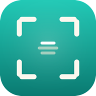

# Kescher — Idea Inbox

Blitzschnelles Erfassen von Ideen, Features, Bugs und Tasks **mit Screenshots** —
und ein Knopf, der den gesammelten Stapel als lokale Markdown-Tickets in einen
Ordner schreibt, den **Claude Code** direkt lesen kann.

Ersetzt den mühsamen Umweg „Screenshot in Apple Notes → am Abend Screenshot-vom-
Screenshot → Text kopieren". Screenshot per `⌘V`, Kommentar tippen, fertig.



---

## Einmal einrichten

### 1. Starten
```bash
./start.command      # Doppelklick im Finder – oder im Terminal
# oder:
npm start            # = python3 -m http.server 4177
```
Öffnet `http://localhost:4177/` in **Chrome / Arc / Brave / Edge**
(Safari kann die nötige File System Access API nicht — Chromium ist Pflicht).

### 2. Als App installieren (empfohlen)
In der Adressleiste das **Installieren-Icon** anklicken (oder Menü →
„Kescher installieren"). Danach liegt Kescher als eigenständige App mit
Dock-Icon vor und läuft **offline** — der lokale Server muss dann nicht mehr
laufen. (Nur nach App-Updates einmal mit laufendem Server neu laden.)

### 3. Ordner verbinden (einmal)
Oben rechts **„Ordner verbinden"** → dieses Projektverzeichnis
(`Notizen/`) wählen. Kescher legt darin bei Bedarf `inbox/` an und merkt sich
die Freigabe dauerhaft.

---

## Täglicher Ablauf

**Erfassen** (tagsüber, App bleibt offen):
1. Titel tippen — *„Was ist die Idee?"*
2. Typ wählen: Idee / Feature / Bug / Task
3. optional Details ins Textfeld
4. **Screenshot**: `⌘⇧⌃4` (Screenshot in die Zwischenablage) → in Kescher `⌘V`.
   Alternativ Bild in die Zone ziehen oder klicken zum Auswählen. Mehrere möglich.
5. **Erfassen** (oder `⌘↵`). Das Ticket landet im Stapel „Gesammelt".

**Abends abarbeiten:**
1. In Kescher **„→ in Inbox schreiben"** klicken → jeder offene Eintrag wird zu
   einem Ordner unter `inbox/` (Markdown + Bilder). Geschriebene rutschen in den
   Bereich „Geschrieben".
2. Im Terminal bei Claude Code:
   > *„arbeite die Inbox ab"*

   Claude liest `inbox/`, sieht Text **und** Screenshots und erzeugt daraus die
   fertigen Tickets.
3. Der Bereich **„Zuletzt geschrieben"** behält nur den *letzten* Schreibvorgang
   als Sicherheitsnetz (falls beim Abarbeiten etwas schiefgeht); ältere werden beim
   nächsten Schreiben automatisch entfernt. Die Dateien im `inbox/` bleiben ohnehin.

---

## Was im `inbox/` landet

Pro Ticket ein Ordner:
```
inbox/
  2026-08-19_1432-05_dark-mode-fuer-settings/
    ticket.md
    shot-1.png
    shot-2.png
```
`ticket.md`:
```markdown
---
title: "Dark Mode für Settings"
type: feature
created: 2026-08-19T12:32:05.000Z
status: open
---

Toggle oben rechts, System-Preference respektieren.

## Screenshots


```

---

## Anpassen
- **Name / Farben / Fonts**: `styles.css` (CSS-Variablen ganz oben) und der
  App-Name in `index.html` / `manifest.webmanifest`.
- **Port**: `KESCHER_PORT=5000 ./start.command` oder `package.json`.
- **Icon neu bauen**: `npm run icons` (Motiv in `tools/make_icons.py`).

## Technik & Grenzen
- Reines HTML/CSS/JS, kein Build, keine Dependencies. Fonts lokal in `fonts/`.
- Daten liegen in **IndexedDB** des Browsers/der PWA (nichts verlässt den Rechner,
  bis du „in Inbox schreiben" drückst). Deinstallieren der PWA / Löschen der
  Browserdaten entfernt noch nicht geschriebene Tickets — im Zweifel vorher
  schreiben.
- **Chromium-Browser Pflicht** (File System Access API). Kein Safari, kein Firefox.
- Offline-fähig via Service Worker (`sw.js`). Nach Code-Änderungen die
  `CACHE`-Version in `sw.js` erhöhen, damit Updates sicher greifen.

---

## Marke & Lizenzen
- **Produkt:** Kescher — gebaut von **SELAS**.
- **Logo** `assets/selas-logo.svg` — Marke SELAS; Schriftzug in **Lexend**.
- **Schriften** (lokal in `fonts/`, SIL OFL 1.1): Bricolage Grotesque,
  JetBrains Mono, Lexend — siehe [`fonts/LICENSES.md`](fonts/LICENSES.md).
- **Code:** © SELAS. Eine Code-Lizenz (z. B. MIT) kann bei Bedarf ergänzt werden.
